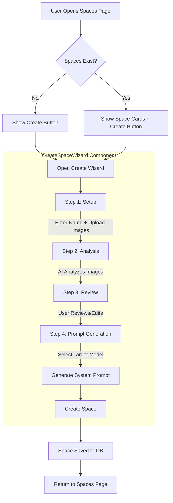

# Create Space - Flow Documentation

This document describes the high-level flow of the **Create Space** functionality, including application flow, API/AI calls, and the prompts used.

---

## Overview

The "Create Space" feature allows users to define a reusable visual style by uploading reference images and having AI analyze them to generate a consistent prompt for future image generation.

---

## Application Flow

The flow is implemented as a **4-step wizard** in the frontend, with corresponding backend API routes handling the AI-powered analysis and generation.



### Step-by-Step Breakdown

| Step | UI State | User Action | Outcome |
|------|----------|-------------|---------|
| **1. Setup** | Form fields + Image uploader | Enter style name, upload 1-10 reference images | Enables "Analyze Style" button |
| **2. Analysis** | Loading spinner | Wait for AI analysis | Form auto-populates with AI-generated values |
| **3. Review** | Editable text fields | Review/edit objective, constraints, style definition | User confirms or tweaks AI suggestions |
| **4. Prompt** | Model selector + Prompt preview | Select target model (Gemini or Flux), generate prompt | Final system prompt is generated |
| **Create** | - | Click "Create Space" | Space is saved to database |

---

## API / AI Calls

The wizard triggers **three main API endpoints**, each invoking AI models:

### 1. POST `/api/spaces/analyze`

**Purpose**: Analyze reference images and synthesize style parameters.

**Flow**:
1. Receive space name + reference images (base64 data URLs)
2. **AI Call 1**: For each image (up to 3), call `OpenAIConnector.analyzeReference()`
3. **AI Call 2**: Call `OpenAIConnector.synthesizeSpaceParams()` to combine analyses
4. Return `{ objective, constraints, styleDefinition }`

**AI Calls Made**:
| Method | Model | Description |
|--------|-------|-------------|
| `analyzeReference()` | `gpt-5-nano` (OpenAI) | Vision-enabled analysis of each image |
| `synthesizeSpaceParams()` | `gpt-5-nano` (OpenAI) | Combine analyses into structured JSON |

---

### 2. POST `/api/spaces/generate-prompt`

**Purpose**: Generate a model-specific system prompt for image generation.

**Flow**:
1. Receive name, objective, constraints, styleDefinition, targetModel
2. Find a Gemini text model from settings
3. **AI Call**: Call `GenerationService.generateSpacePrompt()` with Gemini
4. Return `{ prompt }`

**AI Calls Made**:
| Method | Model | Description |
|--------|-------|-------------|
| `generateSpacePrompt()` | Gemini (configurable) | Generate optimized system prompt for target model |

---

### 3. POST `/api/spaces`

**Purpose**: Save the space to the database.

**Flow**:
1. Receive all form data + generated prompt + references
2. **AI Call 1**: Analyze each reference image (if not already done)
3. **AI Call 2**: Build the final space prompt using `buildSpacePrompt()`
4. Insert space record into `spaces` table
5. Insert reference images into `space_images` table
6. Return the created space object

**AI Calls Made**:
| Method | Model | Description |
|--------|-------|-------------|
| `analyzeReference()` | `gpt-5-nano` (OpenAI) | (Optional) Analyze new references |
| `buildSpacePrompt()` | `gpt-5-nano` (OpenAI) | Generate final reusable prompt |

---

## Prompts Used

All prompts are defined in [`lib/prompts.ts`](file:///c:/Users/aless/Code/coloring-book-booster/lib/prompts.ts) and can be overridden via the `system_configs` database table.

### 1. Image Analysis Prompt

**Config Key**: `space_analysis_prompt`  
**Used By**: `OpenAIConnector.analyzeReference()`

```text
Analyze this reference image and provide 3-5 concise bullet points covering:
line style, color palette (or lack thereof), complexity, composition, and
recurring elements to maintain or avoid.
```

---

### 2. Synthesis Prompt

**Config Key**: `space_synthesis_prompt`  
**Used By**: `OpenAIConnector.synthesizeSpaceParams()`

```text
Based on the following image analyses for a style named "{name}", synthesize
the core parameters for a generative AI model.

Analyses:
{analyses}

Return a JSON object with exactly these keys:
- objective: A clear, positive description of what the style achieves (visual characteristics, mood).
- constraints: What should be avoided to maintain this style (negative constraints).
- styleDefinition: A concise, high-level definition of the style (e.g. "Vintage Comic Book", "Minimalist Line Art").

Do not include markdown formatting, just the raw JSON string.
```

---

### 3. Space Generation Prompt

**Config Key**: `space_generation_prompt`  
**Used By**: `OpenAIConnector.buildSpacePrompt()`

```text
You are a prompt engineer. You receive descriptions and reference analyses to
build a unique, concise, and complete Space Prompt. The prompt must be reusable,
describing tone, composition, lines, allowed complexity, elements to avoid,
palette, and output format. Return only the final prompt text.
```

---

### 4. Space Prompt Generation Prompt (Model-Specific)

**Config Key**: `space_prompt_generation_prompt`  
**Used By**: `GenerationService.generateSpacePrompt()`

```text
You are an expert Prompt Engineer. Your task is to write a "System Prompt" that
will be used by an AI Image Generator to strictly enforce a specific visual style.

TARGET MODEL: {targetModel}

STRATEGY:
{strategy}

INPUT DATA:
- Style Name: {name}
- Objective: {objective}
- Constraints (Negative): {constraints}
- Style Definition: {styleDefinition}

OUTPUT:
Return ONLY the generated System Prompt. Do not include "Here is the prompt" or
markdown formatting.
```

**Strategy Variations**:
- **Gemini/Imagen**: Natural, descriptive language focusing on feeling and composition
- **Flux (BFL)**: Comma-separated technical tags and keywords

---

### 5. Standardization Prompt

**Config Key**: `space_standardization_prompt`  
**Used By**: `OpenAIConnector.standardizeRequest()` (used when generating images within a space)

```text
Take the following Space Prompt as a fixed style rule. Receive a user request
and transform it into a standardized, clean, and consistent prompt that
faithfully respects the Space. Include necessary corrections and adjustments to
maintain composition, detail level, and established prohibitions.
```

---

## File References

| File | Description |
|------|-------------|
| [CreateSpaceWizard.tsx](file:///c:/Users/aless/Code/coloring-book-booster/components/spaces/CreateSpaceWizard.tsx) | Main wizard UI component |
| [/api/spaces/analyze/route.ts](file:///c:/Users/aless/Code/coloring-book-booster/app/api/spaces/analyze/route.ts) | Image analysis endpoint |
| [/api/spaces/generate-prompt/route.ts](file:///c:/Users/aless/Code/coloring-book-booster/app/api/spaces/generate-prompt/route.ts) | Model-specific prompt generation |
| [/api/spaces/route.ts](file:///c:/Users/aless/Code/coloring-book-booster/app/api/spaces/route.ts) | Space CRUD operations |
| [lib/openai.ts](file:///c:/Users/aless/Code/coloring-book-booster/lib/openai.ts) | OpenAI connector with analysis methods |
| [lib/generation.ts](file:///c:/Users/aless/Code/coloring-book-booster/lib/generation.ts) | Gemini-based generation service |
| [lib/prompts.ts](file:///c:/Users/aless/Code/coloring-book-booster/lib/prompts.ts) | Default prompt definitions |

---

## Database Tables

| Table | Purpose |
|-------|---------|
| `spaces` | Stores space metadata (name, objective, constraints, etc.) and generated prompt |
| `space_images` | Stores reference images with their individual analyses |
| `system_configs` | Stores overridable prompt configurations |
