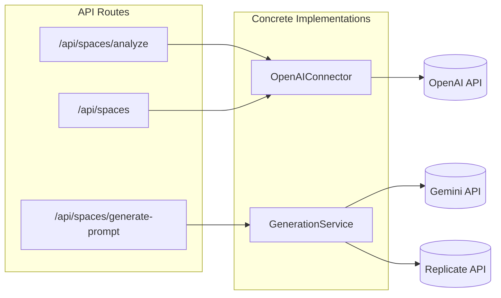
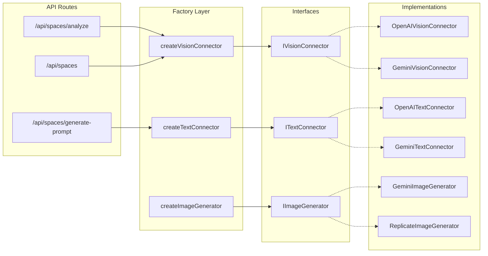

# Refactoring Plan: AI Provider Abstraction Layer

## Problem Statement

The current codebase has **tight coupling** to specific AI providers:

- `OpenAIConnector` is hardcoded to OpenAI's SDK for vision/text tasks
- `GenerationService` has partial abstraction (Gemini vs Replicate) but only for image generation
- API routes directly instantiate concrete classes

This makes it difficult to:
- Swap providers (e.g., use Gemini's vision instead of OpenAI)
- Add new providers (e.g., Anthropic Claude)
- Test with mock implementations
- Let users choose their preferred provider

---

## Current State



**Issues:**
- No interface contracts
- Direct instantiation in routes
- Provider-specific code scattered across files

---

## Proposed Architecture



---

## Implementation Plan

### Phase 1: Define Interfaces

> [!IMPORTANT]
> This phase creates the contracts. No existing code changes yet.

#### [NEW] `lib/connectors/interfaces.ts`

```typescript
export interface ReferenceImageInput {
    dataUrl: string;
    name?: string;
    mimeType?: string;
}

export interface SpacePromptRequest {
    name: string;
    objective: string;
    theme?: string;
    constraints?: string;
    styleDefinition?: string;
    imageAnalyses: string[];
}

export interface SynthesisResult {
    objective: string;
    constraints: string;
    styleDefinition: string;
}

/**
 * Text-only AI operations (no vision)
 */
export interface ITextConnector {
    /**
     * Generate a chat completion
     */
    chat(systemPrompt: string, userMessage: string): Promise<string>;

    /**
     * Synthesize space parameters from analyses
     */
    synthesizeSpaceParams(name: string, analyses: string[]): Promise<SynthesisResult>;

    /**
     * Build a reusable space prompt
     */
    buildSpacePrompt(request: SpacePromptRequest): Promise<string>;

    /**
     * Standardize a user request against a space prompt
     */
    standardizeRequest(spacePrompt: string, userRequest: string): Promise<string>;
}

/**
 * Vision-enabled AI operations
 */
export interface IVisionConnector extends ITextConnector {
    /**
     * Analyze a reference image
     */
    analyzeReference(reference: ReferenceImageInput): Promise<string>;
}

/**
 * Image generation operations
 */
export interface IImageGenerator {
    generateImage(prompt: string, systemPrompt?: string): Promise<GenerationResult>;
}

export type AIProvider = 'openai' | 'gemini' | 'anthropic';
```

---

### Phase 2: Extract Implementations

#### [NEW] `lib/connectors/openai/text-connector.ts`

Refactor from current `OpenAIConnector`:
- Implement `ITextConnector`
- Keep OpenAI-specific logic isolated

#### [NEW] `lib/connectors/openai/vision-connector.ts`

Extends text connector:
- Implement `IVisionConnector`
- Add `analyzeReference()` with vision capability

#### [NEW] `lib/connectors/gemini/text-connector.ts`

New implementation:
- Implement `ITextConnector`
- Use `@google/genai` SDK

#### [NEW] `lib/connectors/gemini/vision-connector.ts`

New implementation:
- Implement `IVisionConnector`
- Use Gemini's vision models (e.g., `gemini-2.0-flash`)

---

### Phase 3: Create Factory

#### [NEW] `lib/connectors/factory.ts`

```typescript
import { ITextConnector, IVisionConnector, AIProvider } from './interfaces';
import { OpenAITextConnector } from './openai/text-connector';
import { OpenAIVisionConnector } from './openai/vision-connector';
import { GeminiTextConnector } from './gemini/text-connector';
import { GeminiVisionConnector } from './gemini/vision-connector';

export async function createTextConnector(provider?: AIProvider): Promise<ITextConnector> {
    // Determine provider from config or parameter
    const selectedProvider = provider ?? await getDefaultTextProvider();
    
    switch (selectedProvider) {
        case 'openai':
            const openaiKey = await resolveOpenAIApiKey();
            return new OpenAITextConnector(openaiKey);
        case 'gemini':
            const geminiKey = await getApiKey();
            return new GeminiTextConnector(geminiKey);
        default:
            throw new Error(`Unknown provider: ${selectedProvider}`);
    }
}

export async function createVisionConnector(provider?: AIProvider): Promise<IVisionConnector> {
    const selectedProvider = provider ?? await getDefaultVisionProvider();
    
    switch (selectedProvider) {
        case 'openai':
            const openaiKey = await resolveOpenAIApiKey();
            return new OpenAIVisionConnector(openaiKey);
        case 'gemini':
            const geminiKey = await getApiKey();
            return new GeminiVisionConnector(geminiKey);
        default:
            throw new Error(`Unknown provider: ${selectedProvider}`);
    }
}
```

---

### Phase 4: Add Configuration

#### [MODIFY] `lib/db/schema.ts`

Add new system config keys:

```typescript
// New config keys to add:
// - 'default_text_provider': 'openai' | 'gemini'
// - 'default_vision_provider': 'openai' | 'gemini'
// - 'default_image_provider': 'gemini' | 'replicate'
```

#### [NEW] Database seed values

```sql
INSERT INTO outlinefactory.system_configs (key, value, description, group) VALUES
('default_text_provider', 'gemini', 'Default provider for text operations', 'ai'),
('default_vision_provider', 'openai', 'Default provider for vision operations', 'ai'),
('default_image_provider', 'gemini', 'Default provider for image generation', 'ai');
```

---

### Phase 5: Refactor API Routes

#### [MODIFY] `app/api/spaces/analyze/route.ts`

```diff
- import { OpenAIConnector } from "@/lib/openai";
+ import { createVisionConnector } from "@/lib/connectors/factory";

  export async function POST(req: Request) {
      // ...
-     const connector = new OpenAIConnector(apiKey, 'gpt-5-nano');
+     const connector = await createVisionConnector();
      // ... rest remains the same
  }
```

#### [MODIFY] `app/api/spaces/route.ts`

Same pattern - replace direct instantiation with factory.

#### [MODIFY] `app/api/spaces/generate-prompt/route.ts`

Already uses `GenerationService`, but update to use factory for consistency.

---

### Phase 6: Deprecate Old Code

#### [DELETE] `lib/openai.ts`

After migration, mark as deprecated or remove entirely.

> [!CAUTION]
> Ensure all imports are updated before deletion.

---

## File Structure After Refactor

```
lib/
├── connectors/
│   ├── interfaces.ts          # All interface definitions
│   ├── factory.ts             # Factory functions
│   ├── openai/
│   │   ├── text-connector.ts
│   │   └── vision-connector.ts
│   ├── gemini/
│   │   ├── text-connector.ts
│   │   ├── vision-connector.ts
│   │   └── image-generator.ts
│   └── replicate/
│       └── image-generator.ts
├── prompts.ts                 # Unchanged
├── config.ts                  # Unchanged
└── generation.ts              # Simplified or deprecated
```

---

## Prompt Configuration Keys

The application stores AI prompts in the `system_configs` table, allowing runtime customization without code changes. These should be reflected and organized as part of this refactor.

### Current Prompt Keys

| Key | Used By | Purpose |
|-----|---------|---------|
| `space_analysis_prompt` | `OpenAIConnector.analyzeReference()` | Prompt for analyzing reference images |
| `space_synthesis_prompt` | `OpenAIConnector.synthesizeSpaceParams()` | Prompt for combining analyses into JSON |
| `space_generation_prompt` | `OpenAIConnector.buildSpacePrompt()` | Prompt for building reusable space prompts |
| `space_standardization_prompt` | `OpenAIConnector.standardizeRequest()` | Prompt for normalizing user requests |
| `space_prompt_generation_prompt` | `GenerationService.generateSpacePrompt()` | Model-specific prompt template |

### Default Values Location

All defaults are defined in [`lib/prompts.ts`](file:///c:/Users/aless/Code/coloring-book-booster/lib/prompts.ts):

```typescript
export const DEFAULT_ANALYSIS_PROMPT = '...';
export const DEFAULT_SYNTHESIS_PROMPT = '...';
export const DEFAULT_GENERATION_PROMPT = '...';
export const DEFAULT_STANDARDIZATION_PROMPT = '...';
export const DEFAULT_SPACE_PROMPT_GENERATION_PROMPT = '...';
```

### Proposed Changes

#### 1. Adopt Naming Convention

Standardize keys with a clear hierarchy:

```
{domain}_{operation}_{provider?}_prompt
```

**New key structure:**

| Current Key | New Key | Notes |
|-------------|---------|-------|
| `space_analysis_prompt` | `space_analysis_prompt` | ✓ Keep |
| `space_synthesis_prompt` | `space_synthesis_prompt` | ✓ Keep |
| `space_generation_prompt` | `space_generation_prompt` | ✓ Keep |
| `space_standardization_prompt` | `space_standardization_prompt` | ✓ Keep |
| `space_prompt_generation_prompt` | `space_system_prompt_gemini` | Split by provider |
| (new) | `space_system_prompt_flux` | For Flux-specific prompts |
| (new) | `space_system_prompt_openai` | For OpenAI-specific prompts |

#### 2. Provider-Specific Prompts

Some prompts may need variations per provider. The factory should load the right prompt:

```typescript
// In factory or connector
async function getPromptForProvider(baseKey: string, provider: AIProvider): Promise<string> {
    // Try provider-specific first
    const providerKey = `${baseKey}_${provider}`;
    const providerPrompt = await getSystemConfig(providerKey, null);
    
    if (providerPrompt) {
        return providerPrompt;
    }
    
    // Fall back to generic
    return getSystemConfig(baseKey, DEFAULT_PROMPTS[baseKey]);
}
```

#### 3. Database Seed Script

Add all prompt keys to the seed for visibility:

```sql
INSERT INTO outlinefactory.system_configs (key, value, description, group) VALUES
-- Provider selection
('default_text_provider', 'gemini', 'Default provider for text operations', 'ai_providers'),
('default_vision_provider', 'openai', 'Default provider for vision operations', 'ai_providers'),
('default_image_provider', 'gemini', 'Default provider for image generation', 'ai_providers'),

-- Space prompts (generic)
('space_analysis_prompt', '...', 'Prompt for analyzing reference images', 'space_prompts'),
('space_synthesis_prompt', '...', 'Prompt for combining analyses into JSON', 'space_prompts'),
('space_generation_prompt', '...', 'Prompt for building reusable space prompts', 'space_prompts'),
('space_standardization_prompt', '...', 'Prompt for normalizing user requests', 'space_prompts'),

-- Model-specific system prompts
('space_system_prompt_gemini', '...', 'System prompt template for Gemini', 'space_prompts'),
('space_system_prompt_flux', '...', 'System prompt template for Flux', 'space_prompts');
```

#### 4. Move Prompt Loading to Interface

Instead of each connector calling `getSystemConfig`, prompts should be injected:

```typescript
// Current (scattered)
class OpenAIVisionConnector {
    async analyzeReference(ref: ReferenceImageInput): Promise<string> {
        const prompt = await getSystemConfig('space_analysis_prompt', DEFAULT);
        // ...
    }
}

// Proposed (centralized)
interface IVisionConnector {
    analyzeReference(ref: ReferenceImageInput, prompt?: string): Promise<string>;
}

// Factory injects prompts
const analysisPrompt = await getPromptForProvider('space_analysis_prompt', provider);
connector.analyzeReference(ref, analysisPrompt);
```

> [!TIP]
> This approach allows the same connector to use different prompts for different spaces or use cases.

### Migration Checklist for Prompts

- [ ] Audit all `getSystemConfig` calls and document keys
- [ ] Add missing keys to database seed
- [ ] Add `group` column values for admin UI organization
- [ ] Create provider-specific prompt variants where needed
- [ ] Update connectors to accept prompts as parameters
- [ ] Update factory to load and inject prompts

---

## Migration Checklist

### Phase 1: Interfaces
- [ ] Create `lib/connectors/interfaces.ts`
- [ ] Define `ITextConnector`, `IVisionConnector`, `IImageGenerator`
- [ ] Export shared types

### Phase 2: Implementations
- [ ] Create `lib/connectors/openai/text-connector.ts`
- [ ] Create `lib/connectors/openai/vision-connector.ts`
- [ ] Create `lib/connectors/gemini/text-connector.ts`
- [ ] Create `lib/connectors/gemini/vision-connector.ts`
- [ ] Ensure all implementations pass existing tests

### Phase 3: Factory
- [ ] Create `lib/connectors/factory.ts`
- [ ] Add helper functions to read provider config

### Phase 4: Configuration
- [ ] Add new system config keys to seed
- [ ] Create admin UI to switch providers (optional)

### Phase 5: Route Migration
- [ ] Update `/api/spaces/analyze/route.ts`
- [ ] Update `/api/spaces/route.ts`
- [ ] Update `/api/spaces/generate-prompt/route.ts`
- [ ] Update any other files importing `OpenAIConnector`

### Phase 6: Cleanup
- [ ] Remove or deprecate `lib/openai.ts`
- [ ] Update documentation
- [ ] Run full test suite

---

## Benefits After Refactor

| Benefit | Description |
|---------|-------------|
| **Swappable Providers** | Change backend without touching API routes |
| **Testability** | Mock interfaces for unit tests |
| **User Choice** | Let users select their preferred provider |
| **Cost Optimization** | Switch to cheaper providers per task |
| **Future-Proof** | Easy to add Anthropic, Mistral, etc. |

---

## Risks and Mitigations

| Risk | Mitigation |
|------|------------|
| Feature parity issues | Test all providers against same prompts |
| Different response formats | Normalize in connector implementation |
| API key management complexity | Centralize in factory with clear error messages |
| Performance differences | Add logging/metrics per provider |

---

## Estimated Effort

| Phase | Effort | Priority |
|-------|--------|----------|
| Phase 1: Interfaces | 2 hours | High |
| Phase 2: Implementations | 4 hours | High |
| Phase 3: Factory | 1 hour | High |
| Phase 4: Configuration | 1 hour | Medium |
| Phase 5: Route Migration | 2 hours | High |
| Phase 6: Cleanup | 1 hour | Low |

**Total: ~11 hours**

---

## Open Questions

1. **Should we support multiple providers simultaneously?** (e.g., OpenAI for vision, Gemini for text)
2. **Per-user provider preferences?** Store in `user_settings` table?
3. **Fallback behavior?** If primary provider fails, try secondary?
4. **Model selection within provider?** (e.g., `gpt-4o` vs `gpt-4o-mini`)
